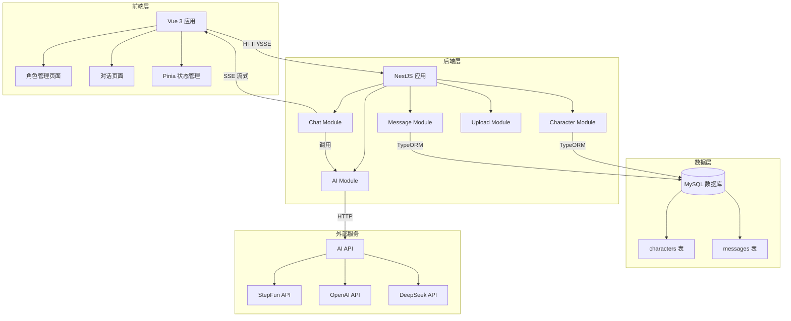
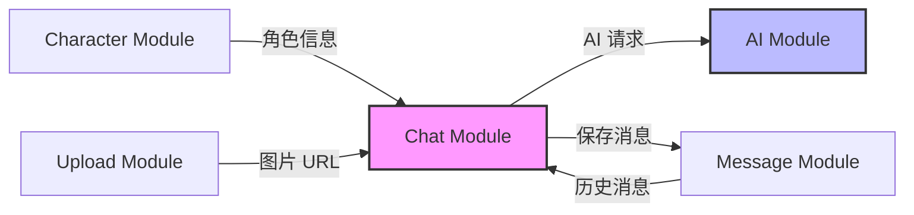
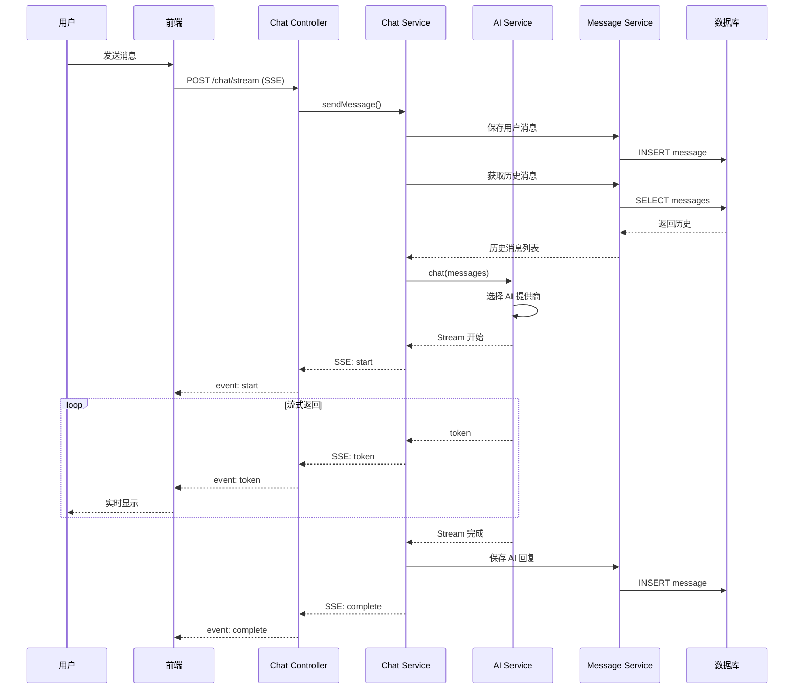

# 角色扮演AI对话平台

## 📖 项目概述

这是一个基于AI的角色扮演对话平台，用户可以创建虚拟角色并与之进行沉浸式对话。

### 核心功能（MVP简化版）

- ✅ 角色创建（简化4字段表单）
- ✅ 文本对话（流式回复）
- ✅ 图片识图（支持发送图片给AI分析）
- ✅ 单对话模式（每个角色只有一个对话）
- ✅ 清空对话（重新开始）
- ✅ 角色删除
- ✅ 预设角色（5个示例角色）
- ✅ 多模型支持（StepFun、OpenAI GPT-4o/GPT-4 Vision、DeepSeek）

## 🚀 快速开始

### 环境要求

- Node.js >= 18.0.0
- MySQL >= 8.0
- npm >= 9.0.0

### 安装步骤

```bash
# 1. 克隆项目
git clone https://github.com/yourname/chat-platform.git
cd chat-platform

# 2. 安装后端依赖
cd backend
npm install

# 3. 配置环境变量
cp .env.example .env
# 编辑 .env 文件，配置数据库和AI API密钥
# 至少配置一个AI API：
# - STEPFUN_API_KEY: 支持图片识图和推理（优先使用）
# - OPENAI_API_KEY: 支持GPT-4o和GPT-4 Vision（可识别图片）
# - DEEPSEEK_API_KEY: 仅支持文本对话

# 4. 创建数据库
mysql -u root -p
CREATE DATABASE chat_platform CHARACTER SET utf8mb4 COLLATE utf8mb4_unicode_ci;

# 5. 启动后端
npm run start:dev

# 6. 安装前端依赖
cd ../frontend
npm install

# 7. 启动前端
npm run dev
```

### 访问应用

- 前端: http://localhost:5173
- 后端API: http://localhost:3000

## 🏗️ 技术架构

### 技术栈

**后端**:
- NestJS 10.3
- TypeORM 0.3.19
- MySQL 8.0
- OpenAI SDK (支持 StepFun/OpenAI/DeepSeek)

**前端**:
- Vue 3.4.15
- TypeScript 5.9.3
- Element Plus 2.5.3
- Pinia 2.1.7
- Vite 5.0.11

### 系统架构图

#### 整体架构



#### 后端模块关系



#### 对话流程



### 项目结构

```
chat-platform/
├── backend/              # 后端服务
│   ├── src/
│   │   ├── modules/
│   │   │   ├── character/   # 角色模块
│   │   │   ├── message/     # 消息模块
│   │   │   ├── chat/        # 聊天模块（SSE）
│   │   │   ├── ai/          # AI服务模块
│   │   │   ├── config/      # 配置模块
│   │   │   └── upload/      # 文件上传模块
│   │   └── main.ts
│   └── package.json
│
└── frontend/             # 前端应用
    ├── src/
    │   ├── views/        # 页面组件
    │   ├── components/   # 可复用组件
    │   ├── api/          # API调用
    │   ├── stores/       # 状态管理
    │   ├── router/       # 路由配置
    │   ├── types/        # 类型定义
    │   └── utils/        # 工具函数
    └── package.json
```

## 🗄️ 数据库设计（简化版）

### 核心表结构

#### characters（角色表）

```sql
CREATE TABLE `characters` (
  `id` VARCHAR(36) PRIMARY KEY COMMENT '主键UUID',
  `name` VARCHAR(100) NOT NULL COMMENT '角色名称',
  `avatarUrl` VARCHAR(500) DEFAULT NULL COMMENT '头像URL',
  `description` VARCHAR(500) NOT NULL COMMENT '角色简介',
  `backgroundStory` TEXT NOT NULL COMMENT '背景故事',
  `systemPrompt` TEXT NOT NULL COMMENT 'AI系统提示词',
  `metadata` JSON DEFAULT NULL COMMENT '扩展字段',
  `isActive` TINYINT(1) NOT NULL DEFAULT 1 COMMENT '是否启用',
  `createdAt` DATETIME NOT NULL DEFAULT CURRENT_TIMESTAMP(6),
  `updatedAt` DATETIME NOT NULL DEFAULT CURRENT_TIMESTAMP(6) ON UPDATE CURRENT_TIMESTAMP(6)
) ENGINE=InnoDB DEFAULT CHARSET=utf8mb4 COLLATE=utf8mb4_unicode_ci;
```

#### messages（消息表）

```sql
CREATE TABLE `messages` (
  `id` VARCHAR(36) PRIMARY KEY COMMENT '主键UUID',
  `userId` VARCHAR(64) NOT NULL DEFAULT 'anonymous' COMMENT '用户ID（设备ID）',
  `characterId` VARCHAR(36) NOT NULL COMMENT '关联角色ID',
  `role` VARCHAR(20) NOT NULL COMMENT '消息角色: user/assistant',
  `content` TEXT NOT NULL COMMENT '消息内容',
  `metadata` JSON DEFAULT NULL COMMENT '扩展字段（如图片URL）',
  `createdAt` DATETIME NOT NULL DEFAULT CURRENT_TIMESTAMP(6),
  KEY `idx_messages_user_character` (`userId`, `characterId`, `createdAt`)
) ENGINE=InnoDB DEFAULT CHARSET=utf8mb4 COLLATE=utf8mb4_unicode_ci;
```

**简化说明**：
- 删除了conversations表，messages直接关联角色（单对话模式）
- 每个用户（通过deviceId识别）与每个角色只保留一个对话
- 支持"清空对话"功能重新开始
- metadata字段存储扩展信息（如图片URL）

## 📚 API文档

### 角色管理接口

```
GET    /api/characters              # 获取角色列表
GET    /api/characters/:id          # 获取角色详情
POST   /api/characters              # 创建角色
DELETE /api/characters/:id          # 删除角色（级联删除消息）
```

### 聊天接口

```
POST   /api/chat/stream             # 发送消息并流式接收AI回复（SSE）
GET    /api/chat/history/:characterId  # 获取角色的聊天历史
DELETE /api/chat/history/:characterId  # 清空角色的聊天历史
```

### 文件上传接口

```
POST   /api/upload/image            # 上传图片（用于识图功能）
```

### 配置接口

```
GET    /api/config/available-models # 获取当前可用的AI模型列表
```

### SSE事件格式

```
event: start
data: {"messageId": "uuid"}

event: token
data: {"content": "文"}

event: complete
data: {"messageId": "uuid", "totalTokens": 150}

event: error
data: {"error": "错误信息"}
```

## 🔧 环境变量配置

创建 `backend/.env` 文件：

```env
# 数据库配置
DB_HOST=localhost
DB_PORT=3306
DB_USERNAME=root
DB_PASSWORD=your_password
DB_DATABASE=chat_platform

# AI API配置（至少配置一个）
# StepFun API（支持图片识图和推理，优先使用）
STEPFUN_API_KEY=your_stepfun_api_key
# DeepSeek API（仅支持文本对话）
DEEPSEEK_API_KEY=your_deepseek_api_key
# OpenAI API（支持GPT-4o和GPT-4 Vision，可选）
OPENAI_API_KEY=your_openai_api_key

# 服务配置
PORT=3000
BASE_URL=http://localhost:3000
```

## 📝 开发日志

- 2026-02-14: 更新README文档，修正数据库表结构（使用camelCase命名），补充文件上传和配置API接口
- 2026-02-13: 项目初始化，创建文档

## 📄 许可证

MIT License
