# 角色扮演AI对话平台

## 📖 项目概述

这是一个基于AI的角色扮演对话平台，用户可以创建虚拟角色并与之进行沉浸式对话。

### 界面预览


### 核心功能

- ✅ 角色创建（简化4字段表单）
- ✅ 文本对话（流式回复）
- ✅ 图片识图（支持发送图片给AI分析）
- ✅ 多对话管理（每个角色支持多个独立对话）
- ✅ 对话列表（时间分组：今天/昨天/更早）
- ✅ 对话搜索（按标题和角色名搜索）
- ✅ 批量删除对话
- ✅ 角色删除（级联删除所有对话和消息）
- ✅ 预设角色（5个示例角色）
- ✅ 多模型支持（StepFun、OpenAI GPT-4o/GPT-4 Vision、DeepSeek）
- ✅ 用户配置（昵称、头像、职业、爱好、简介）
- ✅ 个性化回复风格（默认模式配置）

## 🚀 快速开始

### 环境要求

- Node.js >= 18.0.0
- MySQL >= 8.0
- npm >= 9.0.0

### 安装步骤

```bash
# 1. 克隆项目
git clone https://github.com/yourname/chat-platform.git
cd chat-platform

# 2. 安装后端依赖
cd backend
npm install

# 3. 配置环境变量
cp .env.example .env
# 编辑 .env 文件，配置数据库和AI API密钥
# 至少配置一个AI API：
# - STEPFUN_API_KEY: 支持图片识图和推理（优先使用）
# - OPENAI_API_KEY: 支持GPT-4o和GPT-4 Vision（可识别图片）
# - DEEPSEEK_API_KEY: 仅支持文本对话

# 4. 创建数据库
mysql -u root -p
CREATE DATABASE chat_platform CHARACTER SET utf8mb4 COLLATE utf8mb4_unicode_ci;

# 5. 启动后端
npm run start:dev

# 6. 安装前端依赖
cd ../frontend
npm install

# 7. 启动前端
npm run dev
```

### 访问应用

- 前端: http://localhost:5173
- 后端API: http://localhost:3000

## 🏗️ 技术架构

### 技术栈

**后端**:
- NestJS 10.3
- TypeORM 0.3.19
- MySQL 8.0
- OpenAI SDK (支持 StepFun/OpenAI/DeepSeek)

**前端**:
- Vue 3.4.15
- TypeScript 5.9.3
- Element Plus 2.5.3
- Pinia 2.1.7
- Vite 5.0.11

### 系统架构图

#### 整体架构

```mermaid
graph TB
    subgraph "前端层"
        A[Vue 3 应用]
        A1[角色管理页面]
        A2[对话页面]
        A3[侧边栏-对话列表]
        A4[设置对话框]
        A5[Pinia 状态管理]
        A --> A1
        A --> A2
        A --> A3
        A --> A4
        A --> A5
    end

    subgraph "后端层"
        B[NestJS 应用]
        B1[Character Module]
        B2[Message Module]
        B3[Chat Module]
        B4[AI Module]
        B5[Upload Module]
        B6[Conversation Module]
        B7[UserProfile Module]
        B --> B1
        B --> B2
        B --> B3
        B --> B4
        B --> B5
        B --> B6
        B --> B7
    end

    subgraph "数据层"
        C[MySQL 数据库]
        C1[characters 表]
        C2[messages 表]
        C3[conversations 表]
        C4[user_profiles 表]
        C --> C1
        C --> C2
        C --> C3
        C --> C4
    end

    subgraph "外部服务"
        D[AI API]
        D1[StepFun API]
        D2[OpenAI API]
        D3[DeepSeek API]
        D --> D1
        D --> D2
        D --> D3
    end

    A -->|HTTP/SSE| B
    B -->|TypeORM| C
    B -->|HTTP| D
```



#### 后端模块关系

```mermaid
graph LR
    A[Character Module] -->|角色信息| E[Chat Module]
    B[Message Module] -->|历史消息| E
    C[Conversation Module] -->|对话管理| E
    D[UserProfile Module] -->|用户配置| E
    E -->|AI 请求| F[AI Module]
    G[Upload Module] -->|图片/头像 URL| E
    G -->|头像上传| D
    E -->|保存消息| B
    E -->|创建/更新对话| C

    style E fill:#f9f,stroke:#333,stroke-width:2px
    style F fill:#bbf,stroke:#333,stroke-width:2px
```



#### 对话流程

```mermaid
sequenceDiagram
    participant U as 用户
    participant F as 前端
    participant C as Chat Controller
    participant CS as Chat Service
    participant AI as AI Service
    participant M as Message Service
    participant DB as 数据库

    U->>F: 发送消息
    F->>C: POST /chat/stream (SSE)
    C->>CS: sendMessage()
    CS->>M: 保存用户消息
    M->>DB: INSERT message
    CS->>M: 获取历史消息
    M->>DB: SELECT messages
    DB-->>M: 返回历史
    M-->>CS: 历史消息列表
    CS->>AI: chat(messages)
    AI->>AI: 选择 AI 提供商
    AI-->>CS: Stream 开始
    CS-->>C: SSE: start
    C-->>F: event: start
    loop 流式返回
        AI-->>CS: token
        CS-->>C: SSE: token
        C-->>F: event: token
        F-->>U: 实时显示
    end
    AI-->>CS: Stream 完成
    CS->>M: 保存 AI 回复
    M->>DB: INSERT message
    CS-->>C: SSE: complete
    C-->>F: event: complete
```



### 项目结构

```
chat-platform/
├── backend/              # 后端服务
│   ├── src/
│   │   ├── modules/
│   │   │   ├── character/   # 角色模块
│   │   │   ├── message/     # 消息模块
│   │   │   ├── chat/        # 聊天模块（SSE）
│   │   │   ├── ai/          # AI服务模块
│   │   │   ├── config/      # 配置模块
│   │   │   ├── upload/      # 文件上传模块
│   │   │   ├── conversation/   # 对话管理模块
│   │   │   └── user-profile/   # 用户配置模块
│   │   └── main.ts
│   └── package.json
│
└── frontend/             # 前端应用
    ├── src/
    │   ├── views/        # 页面组件
    │   │   ├── ChatLayout.vue      # 聊天布局
    │   │   └── ChatPage.vue        # 对话页面
    │   ├── components/   # 可复用组件
    │   │   ├── Sidebar.vue              # 侧边栏（对话列表+搜索）
    │   │   ├── ConversationList.vue     # 对话列表（时间分组）
    │   │   ├── SettingsDialog.vue       # 设置对话框
    │   │   ├── AboutYouPanel.vue        # 关于你面板
    │   │   ├── PersonalConfigPanel.vue  # 个性化配置面板
    │   │   └── MessageCard.vue          # 消息卡片
    │   ├── api/          # API调用
    │   ├── stores/       # 状态管理
    │   │   ├── character.ts      # 角色状态
    │   │   ├── chat.ts           # 聊天状态
    │   │   ├── conversation.ts   # 对话状态
    │   │   ├── userProfile.ts    # 用户配置状态
    │   │   └── device.ts         # 设备ID状态
    │   ├── router/       # 路由配置
    │   ├── types/        # 类型定义
    │   └── utils/        # 工具函数
    └── package.json
```

## 🗄️ 数据库设计（简化版）

### 核心表结构

#### characters（角色表）

```sql
CREATE TABLE `characters` (
  `id` VARCHAR(36) PRIMARY KEY COMMENT '主键UUID',
  `name` VARCHAR(100) NOT NULL COMMENT '角色名称',
  `avatarUrl` VARCHAR(500) DEFAULT NULL COMMENT '头像URL',
  `description` VARCHAR(500) NOT NULL COMMENT '角色简介',
  `backgroundStory` TEXT NOT NULL COMMENT '背景故事',
  `systemPrompt` TEXT NOT NULL COMMENT 'AI系统提示词',
  `metadata` JSON DEFAULT NULL COMMENT '扩展字段',
  `isActive` TINYINT(1) NOT NULL DEFAULT 1 COMMENT '是否启用',
  `createdAt` DATETIME NOT NULL DEFAULT CURRENT_TIMESTAMP(6),
  `updatedAt` DATETIME NOT NULL DEFAULT CURRENT_TIMESTAMP(6) ON UPDATE CURRENT_TIMESTAMP(6)
) ENGINE=InnoDB DEFAULT CHARSET=utf8mb4 COLLATE=utf8mb4_unicode_ci;
```

#### messages（消息表）

```sql
CREATE TABLE `messages` (
  `id` VARCHAR(36) PRIMARY KEY COMMENT '主键UUID',
  `userId` VARCHAR(64) NOT NULL DEFAULT 'anonymous' COMMENT '用户ID（设备ID）',
  `characterId` VARCHAR(36) NOT NULL COMMENT '关联角色ID',
  `conversationId` VARCHAR(36) NOT NULL DEFAULT 'default' COMMENT '关联对话ID',
  `role` VARCHAR(20) NOT NULL COMMENT '消息角色: user/assistant',
  `content` TEXT NOT NULL COMMENT '消息内容',
  `metadata` JSON DEFAULT NULL COMMENT '扩展字段（如图片URL、卡片数据）',
  `createdAt` DATETIME NOT NULL DEFAULT CURRENT_TIMESTAMP(6),
  KEY `idx_messages_user_character` (`userId`, `characterId`, `createdAt`),
  KEY `idx_messages_conversation` (`conversationId`, `createdAt`)
) ENGINE=InnoDB DEFAULT CHARSET=utf8mb4 COLLATE=utf8mb4_unicode_ci;
```

#### conversations（对话表）

```sql
CREATE TABLE `conversations` (
  `id` VARCHAR(36) PRIMARY KEY COMMENT '主键UUID',
  `userId` VARCHAR(64) NOT NULL COMMENT '用户ID（设备ID）',
  `characterId` VARCHAR(36) NOT NULL COMMENT '关联角色ID',
  `title` VARCHAR(200) NOT NULL COMMENT '对话标题',
  `createdAt` DATETIME NOT NULL DEFAULT CURRENT_TIMESTAMP(6),
  `updatedAt` DATETIME NOT NULL DEFAULT CURRENT_TIMESTAMP(6) ON UPDATE CURRENT_TIMESTAMP(6),
  KEY `idx_conversations_user_character` (`userId`, `characterId`, `createdAt`),
  KEY `idx_conversations_user_updated` (`userId`, `updatedAt`)
) ENGINE=InnoDB DEFAULT CHARSET=utf8mb4 COLLATE=utf8mb4_unicode_ci;
```

**说明**：
- 支持每个角色创建多个独立对话
- title自动生成（截取首条消息前20字）或用户自定义
- updatedAt用于对话列表排序

#### user_profiles（用户配置表）

```sql
CREATE TABLE `user_profiles` (
  `id` VARCHAR(36) PRIMARY KEY COMMENT '主键UUID',
  `userId` VARCHAR(64) NOT NULL UNIQUE COMMENT '用户ID（设备ID）',
  `name` VARCHAR(100) DEFAULT NULL COMMENT '用户昵称',
  `avatarUrl` VARCHAR(500) DEFAULT NULL COMMENT '用户头像URL',
  `occupation` VARCHAR(100) DEFAULT NULL COMMENT '职业',
  `hobbies` JSON DEFAULT NULL COMMENT '爱好列表',
  `bio` VARCHAR(500) DEFAULT NULL COMMENT '个人简介',
  `defaultModeId` VARCHAR(36) DEFAULT NULL COMMENT '默认回复风格（预设模式ID）',
  `createdAt` DATETIME NOT NULL DEFAULT CURRENT_TIMESTAMP(6),
  `updatedAt` DATETIME NOT NULL DEFAULT CURRENT_TIMESTAMP(6) ON UPDATE CURRENT_TIMESTAMP(6),
  KEY `idx_user_profiles_user` (`userId`)
) ENGINE=InnoDB DEFAULT CHARSET=utf8mb4 COLLATE=utf8mb4_unicode_ci;
```

**说明**：
- 存储用户个人信息，用于AI个性化回复
- hobbies存储为JSON数组
- defaultModeId关联预设角色ID

## 📚 API文档

### 角色管理接口

```
GET    /api/characters              # 获取角色列表
GET    /api/characters/:id          # 获取角色详情
POST   /api/characters              # 创建角色
DELETE /api/characters/:id          # 删除角色（级联删除消息）
```

### 聊天接口

```
POST   /api/chat/stream             # 发送消息并流式接收AI回复（SSE）
       # Body: { characterId, content, conversationId?, imageUrl? }
GET    /api/chat/history/:characterId  # 获取角色的聊天历史
       # Query: conversationId (可选)
DELETE /api/chat/history/:characterId  # 清空角色的聊天历史
       # Query: conversationId (可选)
```

### 对话管理接口

```
GET    /api/conversations           # 获取对话列表
       # Query: characterId (可选), period (today/yesterday/week/all)
POST   /api/conversations           # 创建新对话
       # Body: { characterId, title? }
GET    /api/conversations/:id       # 获取对话详情
PATCH  /api/conversations/:id/title # 更新对话标题
       # Body: { title }
DELETE /api/conversations/:id       # 删除对话（级联删除消息）
GET    /api/conversations/:id/messages  # 获取对话的所有消息
```

### 用户配置接口

```
GET    /api/user-profile            # 获取用户配置
POST   /api/user-profile            # 创建/更新用户配置
       # Body: { name?, avatarUrl?, occupation?, hobbies?, bio?, defaultModeId? }
POST   /api/user-profile/avatar     # 上传用户头像
       # FormData: file (图片文件)
```

### 文件上传接口

```
POST   /api/upload/image            # 上传图片（用于识图功能）
```

### 配置接口

```
GET    /api/config/available-models # 获取当前可用的AI模型列表
```

### SSE事件格式

```
event: start
data: {"messageId": "uuid"}

event: token
data: {"content": "文"}

event: complete
data: {"messageId": "uuid", "totalTokens": 150}

event: error
data: {"error": "错误信息"}
```

## 🔧 环境变量配置

创建 `backend/.env` 文件：

```env
# 数据库配置
DB_HOST=localhost
DB_PORT=3306
DB_USERNAME=root
DB_PASSWORD=your_password
DB_DATABASE=chat_platform

# AI API配置（至少配置一个）
# StepFun API（支持图片识图和推理，优先使用）
STEPFUN_API_KEY=your_stepfun_api_key
# DeepSeek API（仅支持文本对话）
DEEPSEEK_API_KEY=your_deepseek_api_key
# OpenAI API（支持GPT-4o和GPT-4 Vision，可选）
OPENAI_API_KEY=your_openai_api_key

# 服务配置
PORT=3000
BASE_URL=http://localhost:3000
```

## 📝 开发日志

- 2026-02-15: 完成多对话管理系统升级
  - 新增conversations表和user_profiles表
  - 实现对话列表（时间分组：今天/昨天/更早）
  - 实现对话搜索和批量删除功能
  - 新增用户配置功能（昵称、头像、职业、爱好、简介）
  - 新增个性化回复风格配置
  - 前端新增Sidebar、ConversationList、SettingsDialog等组件
  - 后端新增Conversation Module和UserProfile Module
- 2026-02-14: 更新README文档，修正数据库表结构（使用camelCase命名），补充文件上传和配置API接口
- 2026-02-13: 项目初始化，创建文档

## 📄 许可证

MIT License
